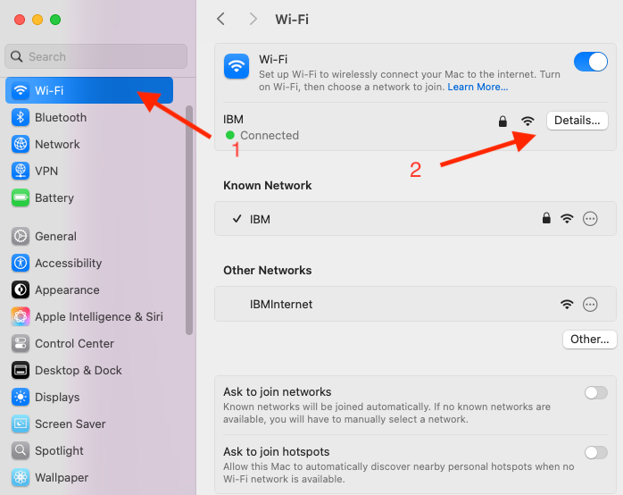

# Scripts to automate creation of Fyre V3 (Development) proxy clusters

These scripts can be used to deploy a Fyre V3 cluster of 2 VMs, one each for the "rtp" and "svl" sites.

Information Needed During Script Execution
1. Fyre Email Address
2. Fyre UserID
3. Fyre API Key
4. An SSH key that will be used to connect to the VMs after they have been provisioned

#### Note: In the examples below hostnames start with "tinyproxy-cluster" which was selected as the cluster name when prompted by the setup-tinyproxy-cluster.sh script.  You should replace the "tinyproxy-cluster" part of the hostnames in these examples with your cluster name.

## Preparation

### Proxy setup

Fyre clusters provisioned using the Frye V3 Development APIs may not have public IP addresses.
In order to access network services on those clusters a proxy needs to be configured.

#### On MacOS



Open "System Settings" and select the "Wi-Fi" panel (red arrow 1).
Select the "Details" button for the the network you are connected to (red arrow 2).


Select the "Proxies" entry in the left navigation panel (red arrow 1).
Enable the "Automatic proxy configuration" section (red arrow 2).
Enter into the "URL" text box under "Proxy configuration file" (red arrow 3) the following value:

```
http://tinyproxy-cluster-rtp.dev.fyre.ibm.com/tinyproxy.pac
```

#### Default SSH Config additions

If you want to enable "ssh root@*.fyre.ibm.com" without needing to reference the fyre_config files in the ~/.cache/tinyproxy-cluster folders, you can add a new section to your ~/.ssh/config file that looks like this:

```
Host *.dev.fyre.ibm.com !tinyproxy-cluster-rtp.dev.fyre.ibm.com !tinyproxy-cluster-svl.dev.fyre.ibm.com
    ProxyCommand nc -X connect -x tinyproxy-cluster-rtp.dev.fyre.ibm.com:8888 %h %p

Host *.fyre.ibm.com
    IdentityFile ~/.ssh/fyre_id_ed25519
    IdentitiesOnly yes
    UserKnownHostsFile /dev/null
    StrictHostKeyChecking accept-new
    ServerAliveInterval 300
    ServerAliveCountMax 2
    PasswordAuthentication no
```

Replace "~/.ssh/fyre_id_ed25519" with whichever ssh keypair you are using to access Fyre VMs.

#### Other applications

You may need to perform similar steps for other applications.
Here is an example for setting the proxy for FileZilla.


Keep in mind that this will cause all sites to use this proxy, even sites that are not under the dev.fyre.ibm.com subdomain.

You should modify any other sites to ignore the proxy by opening the Site Manager (red arrow 1) then select the entry for the site and go to the "Advanced" settings tab (red arrow 2) then check the "Bypass proxy" box (red arrow 3) like this:


### Installing the scripts

The scripts are provided in this git repository so your first step would be to clone the repo like so:
```
git clone git@github.com:gmarcy/ansible.git
```
Here is an example of the expected output:
```
$ git clone git@github.com:gmarcy/ansible.git gmarcy-ansible
Cloning into 'gmarcy-ansible'...
remote: Enumerating objects: 1243, done.
remote: Counting objects: 100% (80/80), done.
remote: Compressing objects: 100% (42/42), done.
remote: Total 1243 (delta 51), reused 38 (delta 38), pack-reused 1163 (from 2)
Receiving objects: 100% (1243/1243), 296.73 KiB | 4.36 MiB/s, done.
Resolving deltas: 100% (622/622), done.
```

#### Note: The scripts will put working files in subfolders under ~/.cache/tinyproxy-cluster

## Running the scripts

### Provision proxy cluster

You will create your proxy cluster using this script:
```
gmarcy-ansible/scripts/setup-tinyproxy-cluster.sh
```
You will be prompted to provide your Fyre credentials.

Here is an example of the output:
```
$ gmarcy-ansible/scripts/setup-tinyproxy-cluster.sh

Enter Fyre credentials

Fyre email address: gmarcy@us.ibm.com
Fyre Username: gmarcy
Fyre API Key:
Testing Fyre API access
Passed

Fyre proxy cluster name [default: "tinyproxy-cluster"]:

Enter path to ssh key (no .pub suffix) you will use to access Fyre VMs [default: generate a new ssh key]: /Users/gmarcy/.ssh/fyre_id_ed25519

Sending requests to build a Fyre proxy cluster named 'tinyproxy-cluster'.
Proxy cluster VM 'tinyproxy-cluster-rtp' is deployable.
Proxy cluster VM 'tinyproxy-cluster-svl' is deployable.
Proxy cluster 'tinyproxy-cluster' created, requesting VMs next.
Proxy cluster 'tinyproxy-cluster' build VMs requested (vm_ids: 2-2348630 1-6295150).
Proxy cluster 'tinyproxy-cluster' VMs added to cluster.

Last build vm request '2-17898299' status is 'success' (13% complete)
  VM 2-2348630 os state is 'building' (13% complete)
Last build vm request '1-164885382' status is 'success' (13% complete)
  VM 1-6295150 os state is 'building' (13% complete)

Last build vm request '2-17898299' status is 'success' (20% complete)
  VM 2-2348630 os state is 'building' (20% complete)
Last build vm request '1-164885382' status is 'success' (20% complete)
  VM 1-6295150 os state is 'building' (20% complete)

...

Last build vm request '2-17898299' status is 'success' (73% complete)
  VM 2-2348630 os state is 'running' (73% complete)
Last build vm request '1-164885382' status is 'success' (100% complete)
  VM 1-6295150 os state is 'running' (100% complete)

Last build vm request '2-17898299' status is 'success' (100% complete)
  VM 2-2348630 os state is 'running' (100% complete)

Checking passwordless ssh access to Fyre proxy cluster tinyproxy-cluster node tinyproxy-cluster-svl.

Installing 'podman' command on tinyproxy-cluster-svl.
Updating Subscription Management repositories.
Red Hat Enterprise Linux 9 for x86_64 - BaseOS  146 MB/s |  68 MB     00:00
Red Hat Enterprise Linux 9 for x86_64 - AppStre 157 MB/s |  64 MB     00:00
...

Complete!

Creating the proxy cluster credentials podman secret.

The podman secret for the proxy cluster credentials now exists.

Creating Fyre inventory in /root/.fyre/clusters/inventory.yml.

Creating playbook for provisioning proxy cluster VMs.

Running automation to provision proxy cluster VMs.
Trying to pull ghcr.io/gmarcy/ansible:latest...
Getting image source signatures
Copying blob sha256:...
...
Writing manifest to image destination

PLAY [Create undefined localhost aliases] **************************************

...
```

The  playbook will run for a few minutes and will look like this when it starts the tinyproxy cluster provisioning:
```
...

PLAY [Run any post_provisioning_roles when requested] **************************

TASK [Iterate over roles for tinyproxy-cluster-svl] ****************************

...

PLAY RECAP *********************************************************************
...
```

The roles used to provision the cluster (from the inventory) are:
```
      post_provisioning_roles:
        - gmarcy.ansible.create_and_authorize_keypairs
```
Unlike the "legacy" Fyre APIs, VMs created do not have local ssh keys and therefore cannot ssh to one another.
This role creates those keypairs and adds them to the authorized_keys file on the VMs so that they can ssh to each other, and themselves, without a password.
```
        - gmarcy.ansible.add_remote_user:
            user_name: tinyproxy
```
We create a tinyproxy user which the tinyproxy server runs under.
```
        - gmarcy.ansible.install_tinyproxy:
            allowed_network_cidr: '9.0.0.0/8'
            filter_allow_patterns:
              - '.*\.dev\.fyre\.ibm\.com$'
            proxy_dns_domain_suffix: '.dev.fyre.ibm.com'
```
We configure the tinyproxy server so that it will only accept connections from the Fyre public network and only allows connections to the local networks on each site.
```
        - gmarcy.ansible.add_remote_ssh_access:
            ssh_key: 'ssh-ed25519 AAAAC3NzaC1lZDI1NTE5AAAAIEl/+WXzrfq5AndgfBFRXXt1JEWyxHq5Q1fXznNyeGom'
            ssh_comment: 'gmarcy@us.ibm.com'
```
I'm using this for testing and will remove this after we believe things are stable.  If we were to create a cluster for wider team use this role can be used to add ssh creds for any admins responsible for maintaining the proxy cluster.